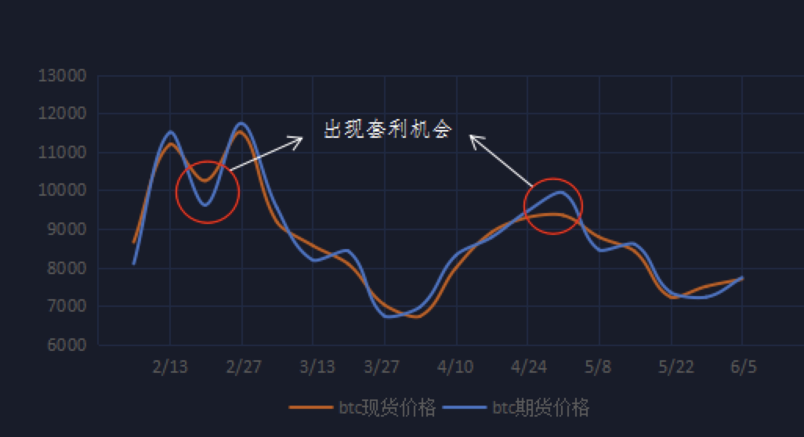

# Spot_contract_ arbitrage

## Strategy description

Spot-contract arbitrave refres to the profitable strategy applies to the price spread between the futures market and spot market: **long in lower price market while short in the higher price market until the price spread disappears to close the positions**.  

Because the future contract settlement system, the prices of the same digital currency is closely connected in the spot market and the futures market, the the futures price will converge with the spot price at latest of the contract expiration date. So you could operate riskless arbitrage when the price spread shows up.  

To some extent, the contact price reflects to the market's expectations of the underlying assets. In the wild fluctuation, the price spread between futures market and spot market will rise up to result a basis. The nuclear logic of this strategy is that the basis of the futures and spot must retrace: the future price  will converge the spot price at latest of the contract expiration date, on the other hand, the basis will trace to the normal levels while the market fluctuations reduction.  

e.g.: let's see how it works, **if the trading fee is for free**

 

On May 1, the price of BTC future is 9925 USD while the price of BTC is 9345 USD, the basis is 580 USD.

On May 15, the price of BTC future is 8590 USD while the price of BTC is 8410 USD, the basis drops down to 180 USD.  

If we short the BTC future valued as 1 BTC at 9925 USD, and we buy 1 BTC at 9345 USDT at the same time on May 1.  

On May 15, close the future position and sell 1 BTC at 8410 USD.  

Then this spot contract arbitrage profit is 400 USD = 580 USD - 180 USD.

We could say that the strategy is **"buying in the spot market, and closeing the contracts in future market"**, the unit profit obtained by investors is the price spread of futures price and the spot pricee at the same time minus the holding cost and settlement cost.  

Besides, we could make the strategy **"higher frequency"**, because if we always wait for the settlement of futures to close the positionsand get the profit, we have few numbers of trades, then the overall profit would be relatively low.  

**Through the monitoring of spot and futures prices, we could find that these two price curves intresect each other sometimes, so we only need to open the position when there is a price spread, and then close thee position when the price is equal to make a profit. When the pricee spread occurs again, we could open the position again. Continuously, there is no need to wait for settlement of futures, then the frequency of trades could be greatly increased, thereby increasing the overall profit**.  

**Spot-contract arbitrage includes positive basis arbitrage and reverse basis arbitrage**:

That is to say, when the spot price is underestimated and the futures contract price is overestimated, you can sell to short the futures contract while buying to long the same amount of spot to establish an arbitrage position. When the price spread of spot and futures becomes normal, close the futures contracts and sell the spot at the same time to obtain profits from it. This is positive basis arbitrage.

Conversely, when the spot price is overestimated and the futures contract price is underestimated, investors could buy to long the futures contract and sell the same amount of spot at the smae time to establish an arbitrage position. When the price spread of spot and futures becomes normal, we need to close the positions at the same time to get profits. This is reverse basis arbitrage. 

**Spot-contract arbitrage has a very important effect on the futures market**:  

1. Because of spot-contract arbitrage, futures prices will not be outrageous and deviate from the spot prices, and it also make the price of digital cureencies more reasonable and more responsive to market trends.  
2. Arbitrage operations helps to improve marekt liquidity, and is more conductive to the smooth progress of invesment trades and hedging operations.  

Bitcoin spot prices fluctuate up and down, and the basis for futures ofthen deviates significantly. If you can control the spot-contract arbitrage  well and seize the opprtunities, you can definitely gain considerable profits.

**However, during the actual operations, the trading fee cannot be ignored, and the number of contracts to be opened may not be exactly and integer**. Therefore, due to these possible error, the profit of spot-contract arbitrage could produce some fluctuations. When the price fluctuates sharply, the fluctuation of income would be relatively large.  

**Moreover, KuCoin provides the transaction data of level 3, great matching engine, and the commission discount specially offers to the API customers, which could greatly reduce the disadvantages of the trading operations. At the same time, we offer the sandbox environment as the data testing support to avoid the risks.**

**Only a simple and incomplete trading strategy is provided here, so please pay attention to avoiding risks when using it. Of course, we do not want you to suffer more losses, so please do not directly run it in the actual environment before you have tested it yourself. We do not want you to become a philanthropist! ! !**

**If you want to use the strategy in the actual environment to earn stable profits, we hope that you can make test adjustments in the sandbox environment with other parameters or strategies to enable you to achieve your goals. We also look forward to sharing your test data and Insights.**

**Surely, if you encounter any problems in this process, or you have a profitable strategy to share, please reflect in ISSUE, we will try to respond in a timely manner.**

